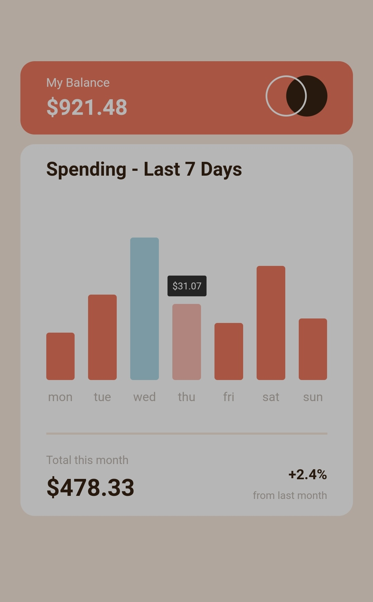

# Expenses chart component
This is a solution to the Expenses chart component challenge on Frontend Mentor. This project composes of HTML and CSS only.

## Table of contents

- [Overview](#overview)
  - [Screenshot](#screenshot)
  - [Links](#links)
- [My process](#my-process)
  - [Built with](#built-with)
  - [What I learned](#what-i-learned)
  - [Continued development](#continued-development)
- [Author](#author)

## Overview
This is a an Expenses chart and it was made using HTML and CSS only. 

### Screenshot

### Links

- Solution URL: (https://github.com/Freecodextra/Expenses-chart-component)
- Live Site URL: (https://expenses-chart-codextra.netlify.app/)

## My process
When i came across the design, i thought I won't be able to code it out until I gave it a try. When help me most is CSS flexbox and div container. I divided the design into three parts, the HEAD, BODY, and BOTTOM.
### Built with
- Semantic HTML5 markup
- CSS custom properties
- Flexbox

### What I learned
- working with css flexbox
-- css hover effect

### Continued development

I will love to work on project and devlop them using react js and other JavaScript libraries and frameworks.

## Author

- Facebook - [Odunayo Joseph Babatunde](https://www.facebook.com/proff_official)
- Frontend Mentor - [@codextra](https://www.frontendmentor.io/profile/codextra)
- Twitter - [@jemapelleprofesseur](https://www.twitter.com/proff_official)
